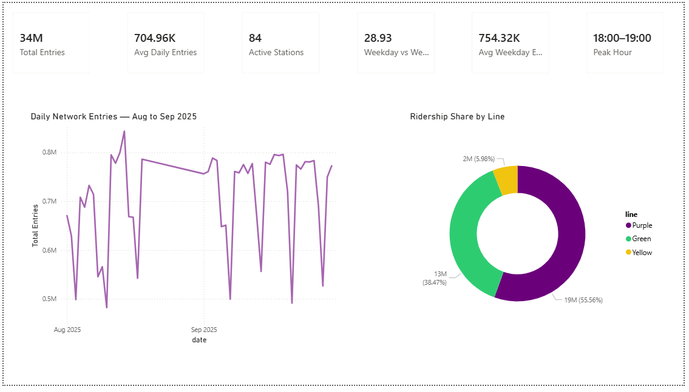
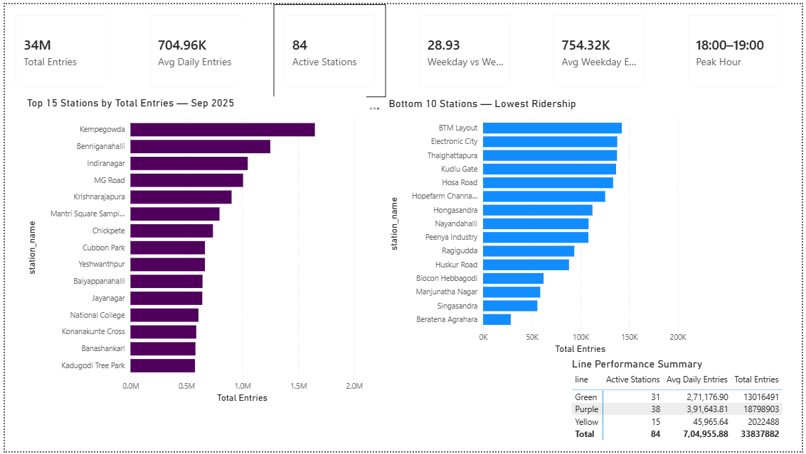
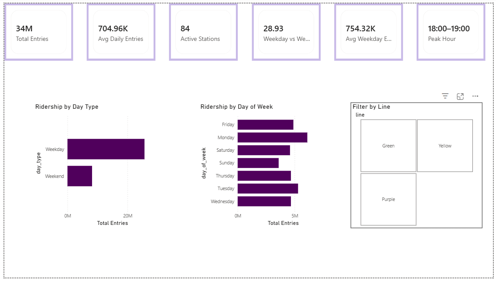
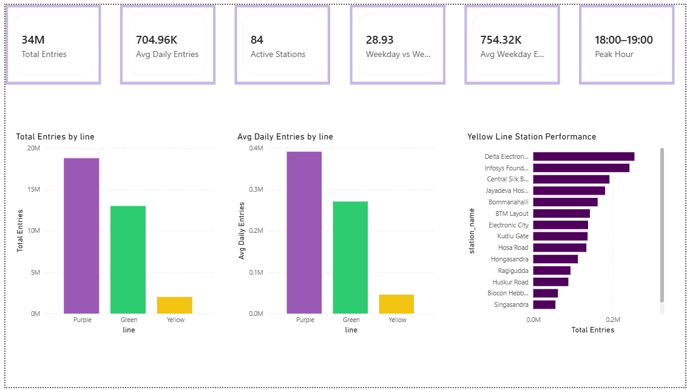

# Bengaluru Metro Analytics & Ridership Forecasting


A full-stack data analytics project analyzing real BMRCL operational 
ridership data across 83 stations using PostgreSQL, Python, and Power BI — 
with a 30-day Prophet forecasting model achieving 5.2% MAPE.

---

## The Business Problem

Bengaluru Metro serves 700,000+ passengers daily across 83 stations on 
three lines. Without data-driven insights, decisions about train frequency, 
staffing allocation, and capacity planning rely on intuition rather than 
evidence.

This project answers five key operational questions:
1. Which stations drive disproportionate ridership — and which underperform?
2. When do peaks occur, and do they vary by station type?
3. How does weekday demand differ from weekends and holidays?
4. How do the Purple, Green, and Yellow lines compare in efficiency?
5. What ridership volume should operations plan for next month?

---

## Key Findings

| Finding | Detail |
|---|---|
| **Top station** | Kempegowda handles 4.7% of total network entries — single point of failure risk |
| **Weekday premium** | Weekday ridership is 28.9% higher than weekends — commuter-dominated demand |
| **Peak hour** | PM peak at 18:00–19:00 network-wide, but varies significantly by station type |
| **Line gap** | Purple Line averages 11K entries/station/day vs Yellow Line's 4K — 63% gap |
| **Concentration** | 59% of stations drive 80% of ridership |
| **Forecast** | Oct 2025 projected at 760,852 avg daily entries (+7.9%) |
| **Model accuracy** | Prophet model achieved 5.2% MAPE via cross-validation |

---

## Dashboard Preview

### Executive Summary


### Station Intelligence


### Time Patterns


### Line Comparison


---

## Project Architecture
bengaluru-metro-analytics/
├── data/
│   ├── raw/                    # Original BMRCL source files
│   └── processed/              # Cleaned data + Power BI export
├── notebooks/
│   ├── 01_data_cleaning.ipynb  # ETL pipeline + PostgreSQL ingestion
│   ├── 02_eda.ipynb            # Exploratory analysis + 7 visualisations
│   └── 03_forecasting.ipynb    # Prophet model + 30-day forecast
├── sql/
│   ├── 01_data_validation.sql  # Quality checks
│   ├── 02_station_kpis.sql     # Station performance metrics
│   ├── 03_time_analysis.sql    # Temporal patterns
│   └── 04_advanced_analytics.sql # Window functions + anomaly detection
├── reports/                    # All charts + dashboard screenshots
├── docs/
│   ├── project_log.md          # Phase-by-phase documentation
│   └── business_recommendations.md  # 5 actionable insights
└── requirements.txt

---

## Tech Stack

| Tool | Purpose |
|---|---|
| **PostgreSQL 18** | Primary data store, schema design |
| **Python 3.12** | Data cleaning, EDA, forecasting |
| **pandas / numpy** | Data manipulation |
| **matplotlib / seaborn** | Visualisation |
| **Prophet** | Time series forecasting |
| **SQLAlchemy** | Database ORM |
| **Power BI Desktop** | Interactive dashboard |
| **Git / GitHub** | Version control |

---

## Data

**Source:** Real BMRCL operational data — hourly entry and exit counts  
**Coverage:** August–September 2025, 83 stations, 6,335 records  
**Lines:** Purple (37 stations), Green (31 stations), Yellow (15 stations)  
**Granularity:** Daily totals + 24 hourly breakdown columns per station  

> Note: Raw data files are excluded from this repository as they contain 
> operational data. The cleaning notebook documents all transformations applied.

---

## How to Run

**1. Clone the repo**
```bash
git clone https://github.com/ts2004T/bengaluru-metro-analytics.git
cd bengaluru-metro-analytics
```

**2. Create and activate virtual environment**
```bash
python -m venv venv
venv\Scripts\activate.bat        # Windows
```

**3. Install dependencies**
```bash
pip install -r requirements.txt
```

**4. Set up environment variables**
```bash
cp .env.example .env
# Edit .env with your PostgreSQL credentials
```

**5. Run notebooks in order**
notebooks/01_data_cleaning.ipynb
notebooks/02_eda.ipynb
notebooks/03_forecasting.ipynb

---

## Business Recommendations

Five actionable recommendations derived from the analysis:

1. **Tiered service frequency** — align train frequency to station demand 
   tiers; potential 8–12% reduction in empty train kilometres
2. **Yellow Line audit** — investigate 63% per-station underperformance 
   vs Purple Line; 20% improvement = ₹88L additional monthly revenue
3. **Weekend optimisation** — leisure partnerships and fare incentives 
   to capture unused weekend capacity
4. **Station-specific peak planning** — IT corridor stations peak at 
   08:00–09:00, commercial zones at 18:00–19:00; uniform policy is 
   insufficient
5. **October capacity planning** — 7.9% projected growth requires 
   proactive staffing and frequency adjustments

Full analysis: [docs/business_recommendations.md](docs/business_recommendations.md)

---

## Project Phases

- [x] Phase 1: Environment setup & version control
- [x] Phase 2: Data cleaning & PostgreSQL ingestion
- [x] Phase 3: SQL analysis (validation, KPIs, time series, window functions)
- [x] Phase 4: Exploratory data analysis (7 visualisations, anomaly detection)
- [x] Phase 5: Power BI dashboard (4 pages, 6 KPI measures)
- [x] Phase 6: Prophet forecasting model (5.2% MAPE, 30-day forecast)
- [x] Phase 7: Business recommendations (5 insights, revenue estimates)
- [x] Phase 8: Documentation & portfolio finalisation

---

## Author

**Tanishka Suryawanshi**  
BTech CSE from SRM University
Bengaluru, India  

[LinkedIn](https://linkedin.com/in/your-linkedin) • 
[GitHub](https://github.com/ts2004T)

---

## Resume Bullet

> Built end-to-end ridership analytics pipeline for 83-station metro 
> network using PostgreSQL, Python, and Power BI; developed Prophet 
> forecasting model achieving 5.2% MAPE, projecting 7.9% ridership 
> growth for Oct 2025 and delivering 5 operational recommendations 
> including a Yellow Line demand audit and tiered service frequency strategy